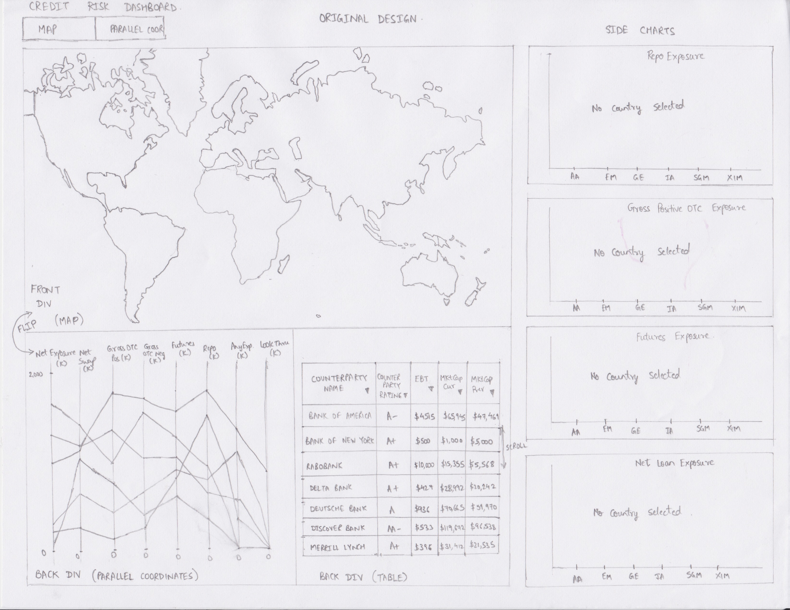
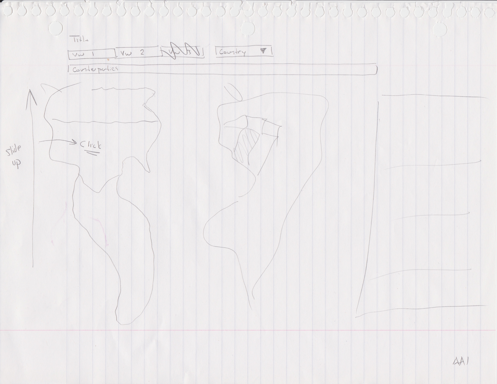
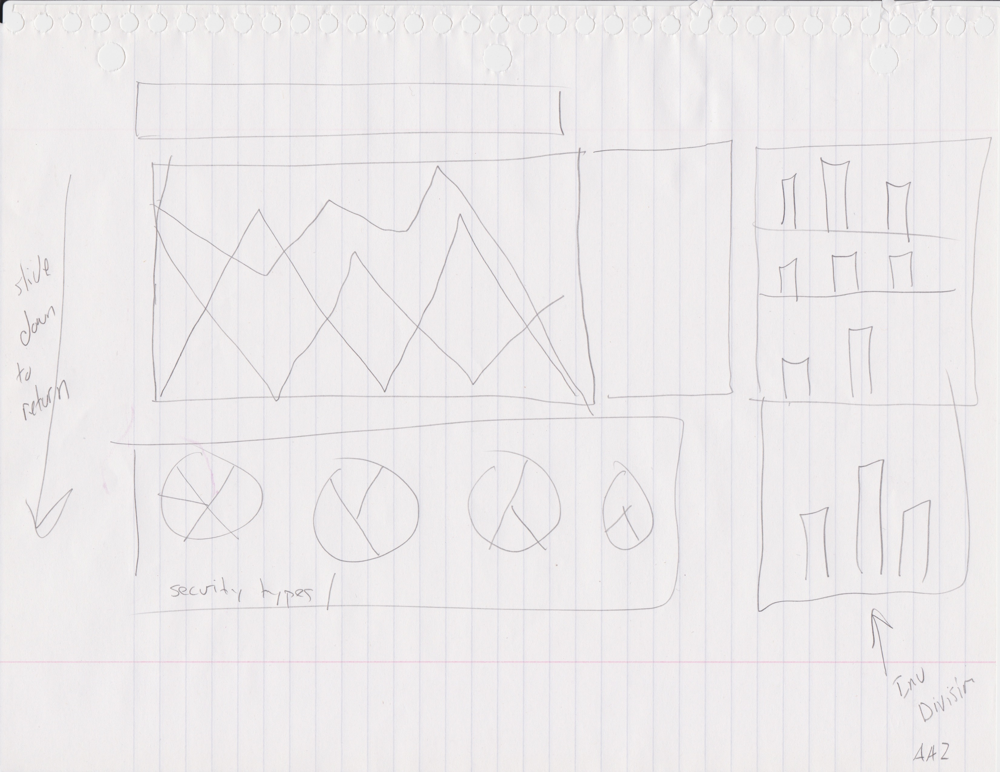
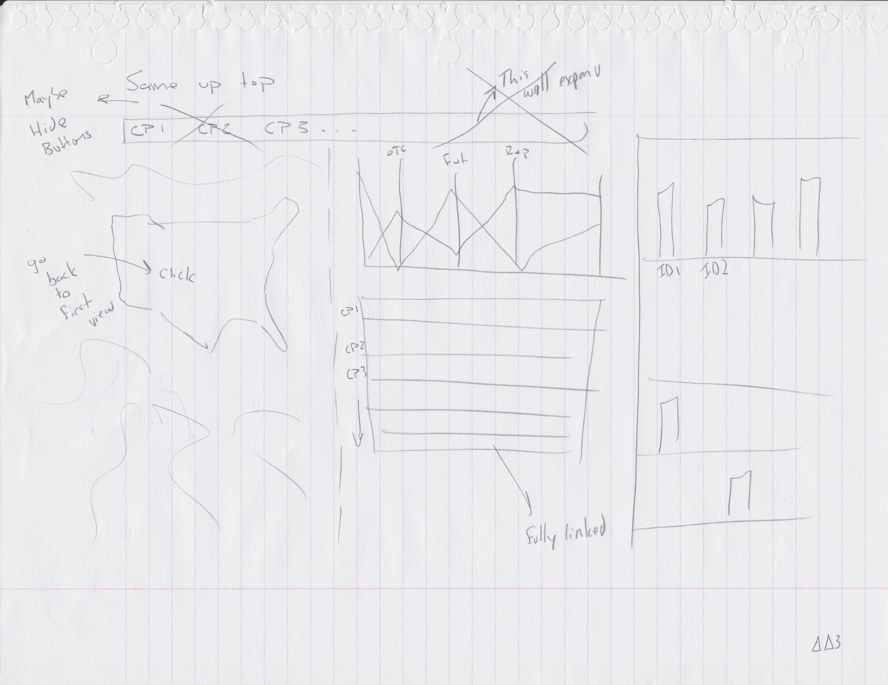
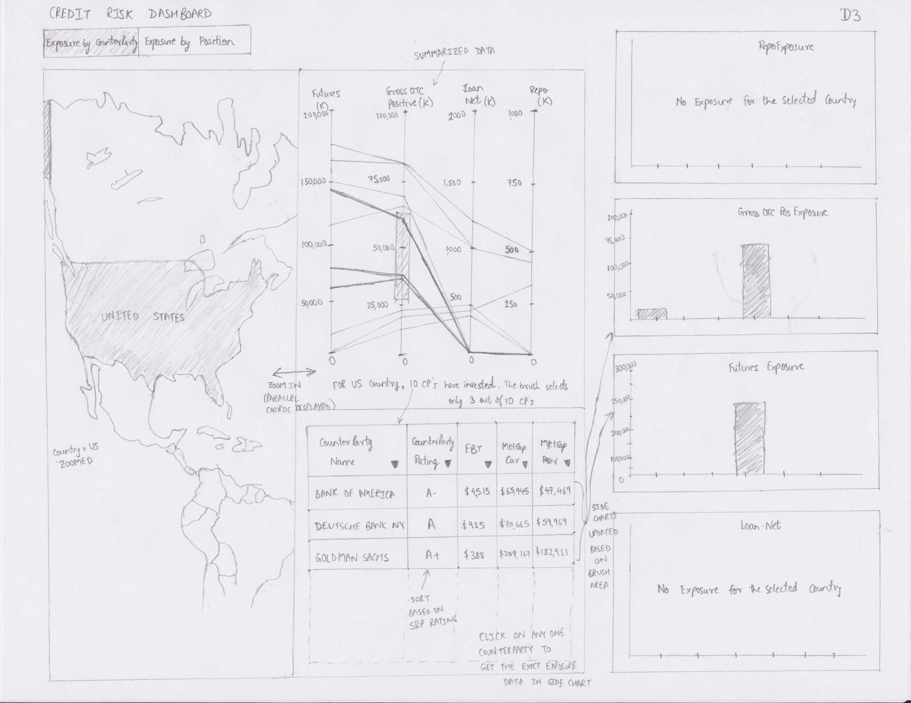
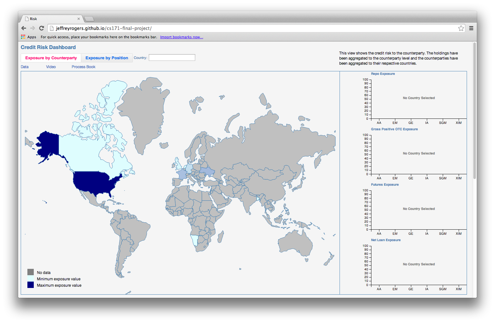
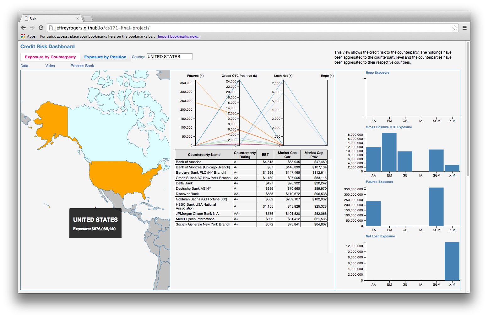

#Process Book

##Project Outline

##Credit Risk Counterparty Dashboard

-	Background and motivation  
	We currently have a report at work that shows the counterparty credit risk information.  However, it is just tabular data and the user must pore through the data to get anything out of it.  Converting this to a visualization has been difficult because the data scales vary so much, standard bar charts and line graphs can't show the smaller values ( they are too short ).  The report has links built in that allow the user to run more detailed reports.  However, it's a call back to the server.  Having all of the data on the page will allow for a better user experience.
	
-	Project Objectives  
	Can we take a large data set with varying data points and scales and create an interactive chart that can replace a static report?  Can the primary visualization of summary data fit on one page and still be legible?  Can the user determine where our greatest risks are in short fashion?
	- Benefits
		- Functionally, the user will spend less time waiting for reports to render since all of the data is loaded at once.
		- The user can quickly determine where the greatest risks are and drill in to those areas more quickly.
		- If done will, this can be presented to executives who are concerned where there money is.

- 	I am collecting the data from work.  We'll obfuscate the counterparty names and the dates from when the data was pulled.  An example is included in the  cp_dash_summ.csv file.  This is summary data.  We'll probably pull a larger data set with a more detailed view.

-	Do you expect to do substantial data cleanup?  
	At most, we expect to aggregate the data by nesting it within the counterparties, security types, and mutual funds.  We'll use a  .csv file that contains flattened, non-normalized data.  We don't expect to have to derive any data that d3 functions can't perform.  We do not expect to perform incremental updates ( ie exit() & release() type functions.).  We'll always referesh the screen.

-	Visualization
	Our primary visualization will be a parallel coordinates graph with a data table underneath (or on the side, depending on the widths).  We will implement smaller charts to highlight certain details.
	
-	Must-have features  
	-	The parallel coords. chart has to be there.  
	-	The parallel coords. chart should have a brushing feature.
	-	All of the data on the charts should be linked.  
	- 	Clicking on a row in the data table locks the selection (re-clicking will unlock the selection).

-	Optional Features
	- We may include a map of the world or tree map showing currency concentration.  This would be on a separate tab or as a pop-up.
	- We may include a tree diagram as a pop-up when a user selects a fund in one of the charts below.  It would show the breakout of exposure by security sub type.
	
-	Schedule
	-	3/20 
		- finalize initial data set
		- get familiar with data and parallel coords chart
		- stub out some code ( import csv, etc )
	-	3/27 
		-	hw 4 due
	-	4/3 
		-	design framework of page for storing svg objects
		-	start coding
	-	4/13
		-	finalize working prototype
	-	4/14
		-	project review
	-	4/21 
		-	have data linked to table
		- 	determine final state
			-	pick an optional task not yet implented
		-	create final css
	-	4/28
		-	final tweeks
		- 	start screencast
	-	5/1
		-	project due

<figure>
	
	<figcaption>Original Design</figcaption>
</figure>

##Overview & Motivation
The primary motivation was related to a report we generate at work.  It has a lot of data points and a lot of white space.  You really have to read the report to understand what is happening.  I thought a visualization would be more beneficial.

This project should give the user a quick view into the counterparties with the largest exposure and a break down of which investment teams are using the counterparty.  

One challenge with a standard chart showing the exposure is the scales are very different.  When we saw the parallel coordinates chart on the d3 examples page, it seemed like a perfect visualation.

We took our idea from this [page](http://exposedata.com/parallel/).  

##Questions

The target user would be a financial risk analyst.  Their primary question will be, "Where is our money?".  The location of which is typically looked at from a country perspective and a bank perspective.  If a bank (counterparty) comes into financial trouble, much like Lehman Brothers did in 2008 then there is a good chance you won't get paid what you are due.  And, if a country is politcally unstable, that could spell trouble for their banks and the strength of their currency.

Our questions changed slightly.  Initially we were looking to show the exposures separately.  However, flipping between the two views was distracting, so we connected them.  This allowed us to break down the exposure and see which counterparties were the heavy hitters.

The second view concentrated on the securities themselves. Though since we linked the map to the counterparty view, the user can see if they have securities held in an unstable country, at an unstable bank (based on the bank rating). 

Linking the two views together gave us some insight one what it would take to sell out of a risky situation.  

##Data

The data came from work.  It was scrubbed and obfuscated there and saved in a .csv file.  The data gathering was done in MS SQL server .

We grabbed the country codes from Wikipedia and manually converted them to a csv format.

We also found the country of incorporation of the counterparties online.  We couldn't find a list, so we searched articles and went to their websites.  There weren't too many so performing this manually, made more sense than looking for a list.

We used this [file](https://raw.githubusercontent.com/johan/world.geo.json/master/countries.geo.json) to create a topo json file for the map.

Once we pulled in the data from the csv files, we created objects and arrays of those objects in javascript.  We aggregated the values to the country, counterparty, and to the investment division.

##Exploratory Data Analysis

We used the report from work to understand what the final numbers look like and to see the data.  We also took the raw csv file of the exposures and put that into a pivot table in Excel.  This gave a quick look at the summary data.

However, once we changed gears with our final visualizaiton layout, the initial analysis wasn't too useful.  We ended up using the visualization itself to check the data.

##Design Evolution

* We have started with the sketches to see how things are going to fit on the screen.  
* It quickly became clear that the detail charts belong on the side to make the best use of the space available.
* We decided to put the map on the "back" of the parallel-coordinates since it's a different slice of the data, and typically a secondary question.  
* During development, the parallel coordinates were developed on a separate file (load_parallel_data.html) since we didn't have the data model objects created yet.
* The detail charts are useful to both visualizations so they stay in view at all times and respond to clicks on the map.
* We want the coloring to be neutral since we are not trying to scare the user.  This data is merely informational.  
* We tried to adhere to the Tufte principals.  Flash, is not the goal.  We want the users to quickly get to the information they are after.
***
* The line here demarks the move towards our current layout.  The flipping of the map to the parallel coordinates was distracting and effectively showed two independent visualizations.
* We started with an idea of having three views.  One would link the map to the p-coords and the other two would be the original planned items.  The transition would be smoother and we'd have some links.
* Eventually, it became obvious that if we wanted two views of the data, they would both have to link the map to the p-coords.  We added the counterparty countries and things started falling into place.

<figure>
	
	<figcaption>Sketch 1</figcaption>
</figure>

<figure>
	
	<figcaption>Sketch 2</figcaption>
</figure>

<figure>
	
	<figcaption>Modification 1</figcaption>
</figure>

* We still had the map, p-coords, and side-charts, but they were acting as one system now instead of two separate reports.

<figure>
	
	<figcaption>Sketch 3</figcaption>
</figure>

<figure>
	
	<figcaption>Second Modified Design</figcaption>
</figure>

<figure>
	
	<figcaption>Final Implementation</figcaption>
</figure>

<figure>
		<figcaption>Final Implementation with Data Visualized</figcaption>
	</img></figure>

##Implementation

The intent is for the user to see the map highlighting the countries with the greatest exposure.  The default view is the exposure rolled up to the country of the counterparty.  We chose a blue scale so as not to alarm the user.  More exposure doesn't necessarily mean something is wrong.  

We also provide the user with a drop down to select a specific country.  If a country is in the news (like Ukraine), they may want to check that out quickly.

Clicking on a country or selecting one from the drop down will drill-in to the country and display the counterparties their company has done deals with. The parallel coordinates chart shows a breakdown of the types of exposure (exposure to Futures, Loans, Repos, and other OTC instruments).  Brushing is enabled so the user can select a group of counterparties.

We chose this particular visualization because it is good at showing a lot of data in a small space.  The multiple scales is useful when having a high exposure amount of one type is not as bad as a lower number in another type.

The table below the chart shows detail information regarding to the counterparties themselves.  The rating, market cap, and earnings before taxes give the user an indication of the relavtive strength of the bank.

Clicking on a Counterparty will break the exposure down by the companies investment divisions.  If a particular trading team is heavily exposed to a risky country or counterparty, they will need to be informed.  These charts give the user a quick look to who needs to be reigned in.

##Evaluation

One thing we learned was that there are connections between the data points that don't always seem obvious.  Also, there is a wealth of imformation online about how stable/risky countries are.  Most of the current information was pay-per-use, so we weren't able to incorporate it.  One thing that would have been nice would be to change the zooming feature of the map to change it to just show the country on the top of its frame.  And then below show statistics of the country that would be relavant to financial analysts.  Based on this data we could change the color scheme and incorporate warning colors.  

Another thing that suprised us was how far out there Spain was in the country exposure.  The data was obfuscated, so there's a possiblity it wasn't Spain, but we were suprised there was such an outlier in the data set.

Overall, the visualization provides a good, high level look at the data.  I think it would set us up nicely to add more drill-ins.  We loaded the detailed data so that could be added fairly easily.

